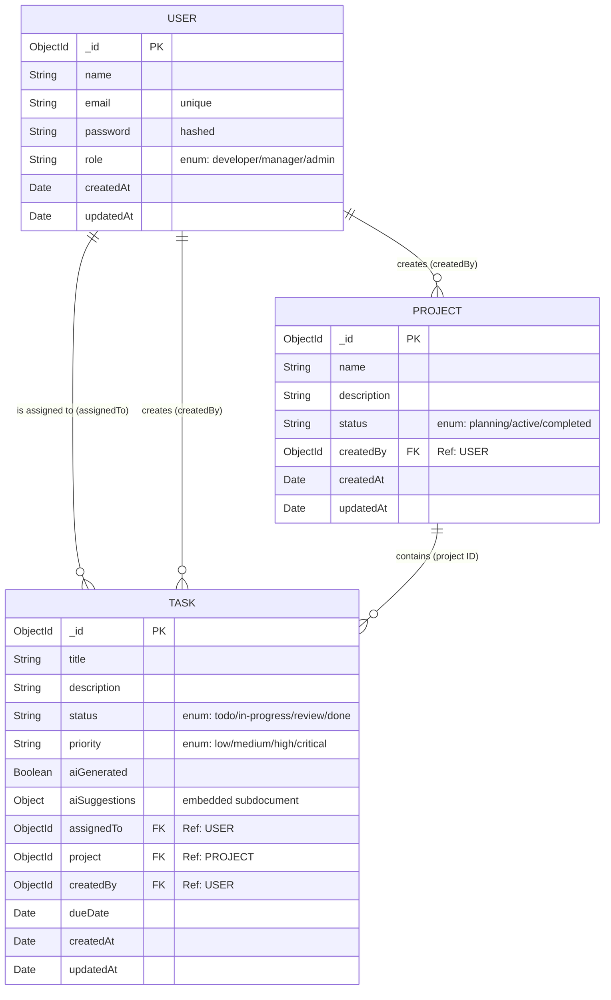

# Database Entity-Relationship Diagram

*Note: In VS Code, right-click anywhere in this file and select **"Open Preview"** (or press `Ctrl+Shift+V`) to see this code instantly turn into a visual image/diagram!*

